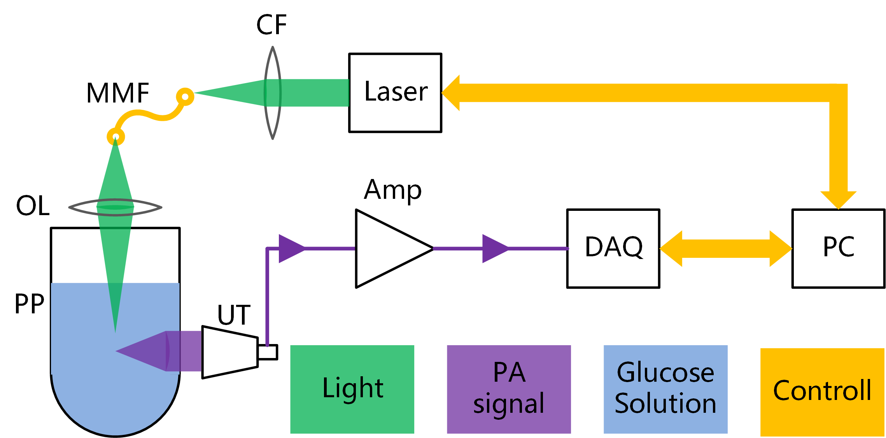

# Dataset_BloodGluose
 Collect the photoacoustic signal of glucose (glucose solution)

## Basic information
### Equipment:  
  
***
### Schematic Diagram：
  
***
### Key Parameter
Pulsed Laser
>*WaveLength*: 1064 nm  
>*Single Pulse Energy*: 6.7 mJ  
>*Pulse Width*: 11.5 ns  

Ultrasonic sensor  
>*Type*: DAOBO (made-in-China)

Signal Amplifier  
>*Type*: Aigtek, ATA-5220
>*Bandwidth*: 1kHz-5MHz
>*Gain*: 60dB

## Author
Copyright: 2018-9-4 MarkLHF, UESTC IDIPLab.(e-mail: 2751867750@qq.com)  
>[ORCID] [0000-0002-8201-5948](https://orcid.org/my-orcid?orcid=0000-0002-8201-5948)   

## Language
MATLAB (currently)  

## History
2021-5-9 upgraded some neccessary data.  
